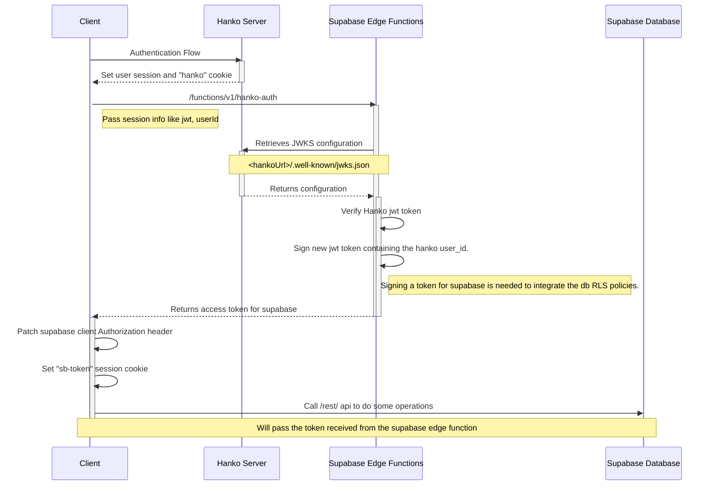

<div align="center">
  
# SpecFlow

[](https://app.netlify.com/sites/specflow/deploys)
[](https://www.hanko.io/)
[](https://github.com/solidjs/solid)
[](https://github.com/seek-oss/vanilla-extract)
<br>
[](https://supabase.com)

</div>

> [!NOTE]
> SpecFlow is an open-source tool (MIT License) made as my [Hanko hackathon](https://www.hanko.io/hackathon) entry. It's a MVP far away to be a complete product,
> born with the aim of testing integrations and interactions between new tech/libraries.
>
> More in detail, in this project I experiment with Hanko's authentication by integrating it with a third party system like supabase,
> the latter used trying to take advantage of the system of generated types, RSL policies and edge functions.
>
> Furthermore, I tried to integrate OpenAI via edge functions to try generating code directly from a user-defined prompt.
>
> It's also a way to improve my [UI Kit library](https://github.com/riccardoperra/codeui) based on [Kobalte](https://github.com/kobaltedev/kobalte) and [Vanilla Extract](https://vanilla-extract.style/) that I'm working on,
> initially created to be the CodeImage design system.

SpecFlow is an online tool that allows to everyone in the tech field (mostly devs and
analysts) to store and centralize their project specs and documentation.

In SpecFlow, users can manage their projects, write markdown like documentation and generate diagrams such as sequence
diagrams, ER, Mind maps etc.

In SpecFlow, users can use AI as an assistant to generate the content they need to show.

In SpecFlow, users can share their project pages with all members of the team, assuring that everyone has all necessary
information for their work.

## 🤖 Tech stack

SpecFlow tech stack is mainly composed by these technologies:

- [Hanko](https://hanko.io)
- [Supabase](https://supabase.com) (Edge Functions and Database)
- [SolidJS](https://github.com/solidjs/solid)
- [Vanilla-Extract](https://vanilla-extract.style/)
- [TailwindCSS](https://tailwindcss.com/)
- [CodeMirror6](https://codemirror.net)
- [TipTap Editor](https://tiptap.dev)
- [Mock Service Worker (next release)](https://mswjs.io/)

Other libraries that I should mention:

- [Kobalte](https://github.com/kobaltedev/kobalte): A SolidJS UI toolkit for building accessible components
- [solid-primitives](https://github.com/solidjs-community/solid-primitives): High quality primitives for SolidJS
  applications.
- [codemirror-lang-mermaid](https://github.com/inspirnathan/codemirror-lang-mermaid): I would never
  have thought of making this application without this library.
- [solid-codemirror](https://github.com/riccardoperra/solid-codemirror): Solid CodeMirror wrapper.
- [CodeUI](https://github.com/riccardoperra/codeui): My UI kit (still wip)
  for [CodeImage](https://github.com/riccardoperra/codeimage)
- [statebuilder](https://github.com/riccardoperra/statebuilder): My composable state management library

## 🔐 Hanko integration details

SpecFlow is a single-page application which integrates Hanko for authentication. All related code which
handles the authentication is in these files:

- [auth.ts](src/core/state/auth.ts): Handles auth state and sync with supabase instance
- [Auth.tsx/HankoAuth.tsx](src/components/Auth): Auth page and hanko auth web component integration with custom styling
- [Profile.tsx/HankoProfile.tsx](src/components/Profile) Profile page and hanko profile web component integration with
  custom styling

### Authentication flow

Supabase Database comes with a useful RSL policy which allows to restrict the access from our data using custom rules.
Since we need that each user can operate only inside it's projects, we need to somehow make supabase
understand who is making the requests.

Since Hanko **is replacing** supabase auth (which is disabled), after the sign-in from the UI we need to extract the data we need
from Hanko's JWT, and sign our own to send to Supabase.

We can do that using hanko `authFlowCompleted` event, which gets called once the user authenticates through the UI.

```typescript
hanko.onAuthFlowCompleted(() => {
  supabase.functions.invoke("hanko-auth", {body: {token: session.jwt}})
});
```

After that event we will call the supabase edge function
in [supabase/functions/hanko-auth](supabase/functions/hanko-auth/index.ts) which validate Hanko JWT token retrieving their JWKS config, then sign ourselves a new token for supabase.

```ts
import * as jose from 'https://deno.land/x/jose@v4.9.0/index.ts';

const hankoApiUrl = Deno.env.get("HANKO_API_URL");
// 1. ✅ Retrieves Hanko JWKS configuration
const JWKS = jose.createRemoteJWKSet(
  new URL(`${hankoApiUrl}/.well-known/jwks.json`),
);
// 2. ✅ Verify Hanko token
const data = await jose.jwtVerify(session.jwt, JWKS);
const payload = {
  exp: data.payload.exp,
  userId: data.payload.sub,
};
// 3. ✅ Sign new token for supabase using it's private key
const supabaseToken = Deno.env.get("PRIVATE_KEY_SUPABASE");
const secret = new TextEncoder().encode(supabaseToken);
const token = await jose.SignJWT(payload)
  .setExpirationTime(data.payload.exp) // We'll set the same expiration time as Hanko token
  .setProtectedHeader({alg: "HS256"}) // Supabase uses a different algorithm
  .sign(secret);
```

Our payload for the JWT will contain the user's identifier from Hanko and the same expiration date.

> [!IMPORTANT]
> We are signing this JWT using Supabase's signing secret token, so it will be able to check the jwt authenticity.
> This is a crucial step which obviously for security reasons cannot be done on the client side.

Once that each supabase fetch call should include our custom token which contains the Hanko **userId**. 
```ts
import {createClient} from 'supabase';

const supabaseUrl = import.meta.env.VITE_CLIENT_SUPABASE_URL;
const supabaseKey = import.meta.env.VITE_CLIENT_SUPABASE_KEY;
const client = createClient(supabaseUrl, supabaseKey);
const originalHeaders = structuredClone(client.rest.headers);

export function patchSupabaseRestClient(accessToken: string | null) {
  // ✅ Set functions auth in order to put the jwt token for edge functions which need authentication
  client.functions.setAuth(accessToken ?? supabaseKey);
  if (accessToken) {
    // ✅ Patching rest headers that will be used for querying the database through rest.
    client['rest'].headers = {
      ...client.rest.headers,
      Authorization: `Bearer ${accessToken}`,
    };
  } else {
    client["rest"].headers = originalHeaders;
  }
}
```

Next, thanks to a **postgres function** we can extract the userId from the jwt in order to let supabase knows which user is authenticated.

```sql
create
or replace function auth.user_id() returns text as
$$
select nullif(current_setting('request.jwt.claims', true)::json ->> 'userId', '')::text;
$$
language sql stable;
```

The supabase database schema is up through the initial migration which will define all functions, tables and rls.

[20231020190554_schema_init.sql](supabase/migrations/20231020190554_schema_init.sql).

You can find all realted migrations [here](https://github.com/riccardoperra/specflow/tree/main/supabase/migrations).

Here a sequence diagram of an in-depth detail of the client side authentication flow (made through SpecFlow 😉)



### Mocking Hanko for local development

SpecFlow integrates the latest version of [MockServiceWorker](https://mswjs.io/) to mock locally the entire Hanko
authentication flow.

The mocking handlers are all present in the [src/mocks/hanko-handlers.ts](src/mocks/hanko-handlers.ts) file.

If the variable `VITE_ENABLE_AUTH_MOCK` is true, you can login with two different users.

Currently both passcode and password flows are mocked, you can toggle them by updating the `ENABLE_PASSCODE_FLOW`
constant in [src/mocks/hanko-handlers.ts](src/mocks/hanko-handlers.ts).

- User1:
    - email: **user1@example.com**
    - password: **password**
    - passcode: 123456

- User2:
    - email: **user2@example.com**
    - password: **password**
    - passcode: 123456

## Local development

Follow the [local_development.md](docs/local_development.md) guide for more information.

## License

MIT © [Riccardo Perra](https://github.com/riccardoperra)
