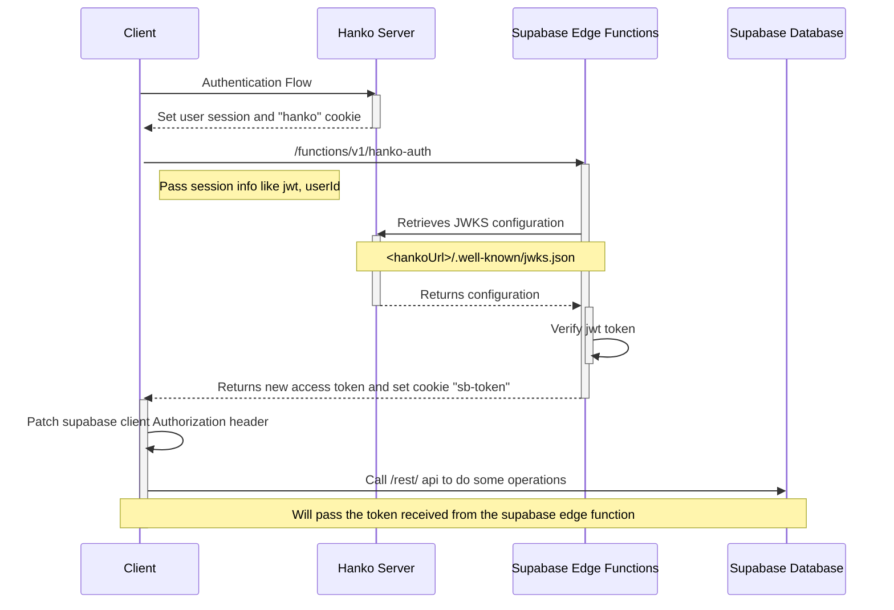

## SpecFlow

SpecFlow is an online tool made for the Hanko hackathon. It allows to everyone in the tech field (mostly devs and
analysts) to store and centralize the project specs and documentation.

In SpecFlow, users can manage their projects, write markdown like documentation and generate diagrams such as sequence
diagrams, ER, Mind maps etc.

In SpecFlow, users can use AI as an assistant to generate the content they need to show.

In SpecFlow, users can share their project pages with all members of the team, assuring that everyone has all necessary
information for their work.

## Tech stack

SpecFlow tech stack is mainly composed by these technologies:

- [Hanko](https://hanko.io)
- [Supabase](https://supabase.com) (Edge Functions and Database)
- [SolidJS](https://github.com/solidjs/solid)
- [Vanilla-Extract](https://vanilla-extract.style/)
- [TailwindCSS](https://tailwindcss.com/)
- [CodeMirror6](https://codemirror.net)
- [TipTap Editor](https://tiptap.dev)

## Hanko integration details

SpecFlow is a single-page application which integrates Hanko as a main authentication flow. All related code which
handles
the authentication is in these files:

- [auth.ts](src/core/state/auth.ts): Handles auth state and sync with supabase instance
- [Auth.tsx](src/components/Auth/Auth.tsx) / [HankoAuth.tsx](src/components/Hanko/HankoAuth.tsx): Auth page and hanko
  web component integration with custom styling
- [Profile.tsx](src/components/Profile/ProfileDialog.tsx) / [HankoProfile.tsx](src/components/Hanko/HankoProfile.tsx):
  Profile page and hanko
  web component integration with custom styling

Since hanko will replace supabase authentication, once hanko trigger the `authFlowCompleted` event, the system will call
the edge function in [supabase/functions/hanko-auth](supabase/functions/hanko-auth/index.ts) in order to retrieve the
Hanko JWKS, validate the given token in the body and stack a new token complaint to supabase to use the row level
security policies.

Once the edge function returns the access_token for supabase, the supabase fetch client is patched with the new token.


The supabase database schema is visible through the initial migration which will define all functions, tables and rls.

[20231020190554_schema_init.sql](supabase/migrations/20231020190554_schema_init.sql)

Here a sequence diagram of an in-depth detail of the client side authentication flow (this is made with SpecFlow 😉)



## Local development

### Table of contents

- [1. Preparing the environment](#1-preparing-the-environment)
- [2. Connect Hanko](#2-init-hanko)
- [3. Initialize supabase](#3-initialize-supabase)
    - [3.1 Connect an external instance](#31-connect-an-external-instance)
    - [3.2 Connect to a local instance](#32-connect-to-a-local-instance)
    - [3.3 Setup environment variables](#33-setup-environment-variables)
- [4. Enable mocks for client-side authentication flow (optional)](#4-enable-mocks-for-client-side-authentication-flow-optional)

### 1. Preparing the environment

This repository uses [pnpm](https://pnpm.io/it/). You need to install **pnpm 8**
and **Node.js v16** or higher.

You can run the following commands in your terminal to check your local Node.js and npm versions:

```bash
node -v
pnpm -v
```

From the project root directory, you can run the following command to install the project's dependencies:

```bash
pnpm install
```

Next, you have to rename and modify the `.env.example` in order to put the environment variables needed by the app.

```bash
cp .env.example .env.local # or .env
```

Env variables will be loaded by vite: https://vitejs.dev/guide/env-and-mode.html

### 2. Init Hanko

In order to init hanko authentication, you must sign-up to their website and register a new project.

https://www.hanko.io/

> [!IMPORTANT]
> Consider that Hanko does not currently support multiple app/redirect urls, so to integrate their
> frontend components you should add "http://localhost:3000" as the App URL in their Dashboard -> Settings -> General
> page.

You can follow their setup guide to init a new Hanko Cloud project: https://docs.hanko.io/setup-hanko-cloud

Once that, you should populate the variable in the `.env` file in order to integrate the authentication in the client
app.

```dotenv
VITE_HANKO_API_URL=https://f4****-4802-49ad-8e0b-3d3****ab32.hanko.io # just an example
```

### 3. Initialize Supabase

SpecFlow integrates [supabase](https://supabase.com/) for database service and edge functions. You can use an existing
hosted instance or provide a self-hosted one.

#### 3.1 Connect an external instance

You can follow the supabase documentation and wizard to bootstrap a new remote instance for free.

https://supabase.com/docs/guides/getting-started

#### 3.2 Connect to a local instance

To run supabase locally you can run the command below, or follow their local development guide for more details.

```bash
pnpm supabase start
```

You can follow the supabase official local development guide for more details.

https://supabase.com/docs/guides/cli/local-development

#### 3.3 Setup environment variables

Once supabase is initialized, you should setup the environment variables needed to access the supabase instance
from the client-side library.

```dotenv
# If you are running supabase locally, put http://localhost:3000, 
# otherwise you should retrieve it from the dashboard,
VITE_CLIENT_SUPABASE_URL=
# If you are running supabase locally, put the `anon key` retrieved by the `pnpm supabase status` command,
# otherwise you should retrieve it from the dashboard,
VITE_CLIENT_SUPABASE_KEY=
```

<h3 id="enable-mocks-for-client-side-auth-flow">4. Enable mocks for client-side authentication flow (optional)</h4>

If you want to skip Hanko's authentication process locally, you can enable the dedicated environment variable. More
information about it in the [Hanko integration section](#hanko-integration-details).

```dotenv
VITE_ENABLE_AUTH_MOCK=true
```

### Roadmap

**Bootstrap**

- [ ] Add README
- [ ] Add contributions page
- [ ] Add MSW to run locally withouth DB/Auth

**Hanko**

- [X] Add auth component
- [ ] Add profile component
- [X] Hanko authorization token integration with supabase
- [ ] Hanko sign with GitHub
- [ ] Improve functions to sign token for supabase

**Features**

- [ ] Project CRUD with supabase security policy
- [X] Project page CRUD with supabase security policy
- [X] Allows to write markdown like pages
- [X] Allows to use mermaid to generate diagram with a real-time preview
- [X] Generate diagrams with OpenAI
- [ ] Generate page markdown content with OpenAI
- [ ] Share link
- [ ] Export mermaid diagram to image
- [ ] Export page to md
- [ ] Sync file with File System API
- [ ] Add responsive layout for mobile/tablet
