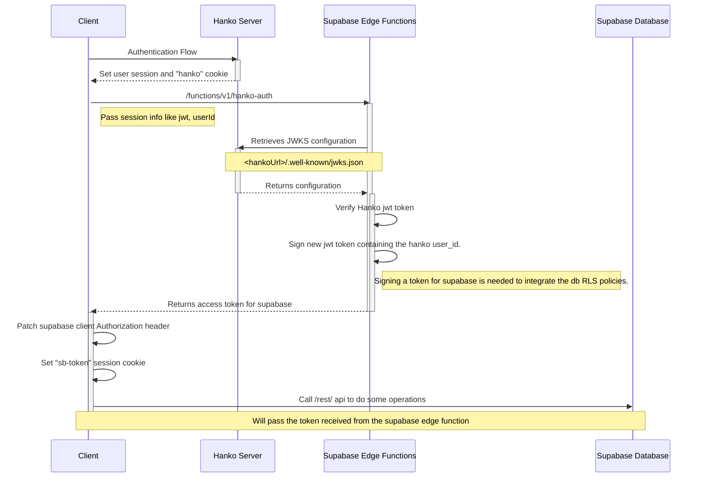

## SpecFlow

SpecFlow is an online tool made for the Hanko hackathon. It allows to everyone in the tech field (mostly devs and
analysts) to store and centralize the project specs and documentation.

In SpecFlow, users can manage their projects, write markdown like documentation and generate diagrams such as sequence
diagrams, ER, Mind maps etc.

In SpecFlow, users can use AI as an assistant to generate the content they need to show.

In SpecFlow, users can share their project pages with all members of the team, assuring that everyone has all necessary
information for their work.

## Tech stack

SpecFlow tech stack is mainly composed by these technologies:

- [Hanko](https://hanko.io)
- [Supabase](https://supabase.com) (Edge Functions and Database)
- [SolidJS](https://github.com/solidjs/solid)
- [Vanilla-Extract](https://vanilla-extract.style/)
- [TailwindCSS](https://tailwindcss.com/)
- [CodeMirror6](https://codemirror.net)
- [TipTap Editor](https://tiptap.dev)
- [Mock Service Worker (next release)](https://mswjs.io/)

## Hanko integration details

SpecFlow is a single-page application which integrates Hanko as a main authentication flow. All related code which
handles
the authentication is in these files:

- [auth.ts](src/core/state/auth.ts): Handles auth state and sync with supabase instance
- [Auth.tsx](src/components/Auth/Auth.tsx): Auth page
- [Profile.tsx](src/components/Profile/ProfileDialog.tsx)
- [HankoAuth.tsx/HankoProfile.tsx](src/components/Hanko):
  Profile and hanko auth web component integration with custom styling

### Authentication flow

Supabase Database comes with a useful RSL policy which allows to restrict the access from our data using custom rules.
Since we need that each user can operate only inside it's projects, we need to somehow make supabase
understand who is making the requests.

Since Hanko **is replacing** supabase auth, after the sign-in in the UI we need to extract the data we need
from Hanko's JWT, and sign our own to send to Supabase.

We can do that using hanko `authFlowCompleted` event, which gets called once the user authenticates through the UI.

```typescript
hanko.onAuthFlowCompleted(() => {
  supabase.functions.invoke("hanko-auth", {body: {token: session.jwt}})
});
```

After that event we will call the supabase edge function
in [supabase/functions/hanko-auth](supabase/functions/hanko-auth/index.ts)
to validate Hanko JWT token retrieving their JWKS config, then sign ourselves a new token for supabase.

```ts
import * as jose from 'https://deno.land/x/jose@v4.9.0/index.ts';

const hankoApiUrl = Deno.env.get("HANKO_API_URL");
// 1. ✅ Retrieves Hanko JWKS configuration
const JWKS = jose.createRemoteJWKSet(
  new URL(`${hankoApiUrl}/.well-known/jwks.json`),
);
// 2. ✅ Verify Hanko token
const data = await jose.jwtVerify(session.jwt, JWKS);
const payload = {
  exp: data.payload.exp,
  userId: data.payload.sub,
};
// 3. ✅ Sign new token for supabase using it's private key
const supabaseToken = Deno.env.get("PRIVATE_KEY_SUPABASE");
const secret = new TextEncoder().encode(supabaseToken);
const token = await jose.SignJWT(payload)
  .setExpirationTime(data.payload.exp)
  .setProtectedHeader({alg: "HS256"}) // Supabase uses a different algorithm
  .sign(new TextEncoder().encode(secret));
```

Our payload for the JWT will contain the user's identifier from Hanko and the same expiration date.

> [!IMPORTANT]
> We are signing this JWT using Supabase's signing secret token, so it will be able to check its authenticity.
> This is a crucial step which obviously for security reasons cannot be done on the client side.

Once that each supabase fetch call should include our custom token which contains the Hanko **userId**. Next, thanks to
a **postgres function** we can extract the userId from the jwt in order to know which user is authenticated.

```sql
create
or replace function auth.user_id() returns text as
$$
select nullif(current_setting('request.jwt.claims', true)::json ->> 'userId', '')::text;
$$
language sql stable;
```

The supabase database schema is up through the initial migration which will define all functions, tables and rls.

[20231020190554_schema_init.sql](supabase/migrations/20231020190554_schema_init.sql)

Here a sequence diagram of an in-depth detail of the client side authentication flow (made with SpecFlow 😉)



### Mocking Hanko for local development

SpecFlow integrates the latest version of [MockServiceWorker](https://mswjs.io/) to mock locally the entire Hanko
authentication flow.

The mocking handlers are all present in the [src/mocks/hanko-handlers.ts](src/mocks/hanko-handlers.ts) file.

If the variable `VITE_ENABLE_AUTH_MOCK` is true, you can login with two different users.

- User1:
    - email: **user1@example.com**
    - password: **password**

- User2:
    - email: **user2@example.com**
    - password: **password**

## Local development

### Table of contents

- [1. Preparing the environment](#1-preparing-the-environment)
- [2. Connect Hanko](#2-init-hanko)
- [3. Initialize supabase](#3-initialize-supabase)
    - [3.1 Connect an external instance](#31-connect-an-external-instance)
    - [3.2 Connect to a local instance](#32-connect-to-a-local-instance)
    - [3.3 Setup environment variables](#33-setup-environment-variables)
- [4. Enable mocks for client-side authentication flow (optional)](#4-enable-mocks-for-client-side-authentication-flow-optional)
- [5. Run the dev servers](#5-run-the-dev-servers)

### 1. Preparing the environment

This repository uses [pnpm](https://pnpm.io/it/). You need to install **pnpm 8**
and **Node.js v16** or higher.

You can run the following commands in your terminal to check your local Node.js and npm versions:

```bash
node -v
pnpm -v
```

From the project root directory, you can run the following command to install the project's dependencies:

```bash
pnpm install
```

Next, you have to rename and modify the `.env.example` in order to put the environment variables needed by the app.

```bash
cp .env.example .env.local # or .env
```

Env variables will be loaded by vite: https://vitejs.dev/guide/env-and-mode.html

### 2. Init Hanko

In order to init hanko authentication, you must sign-up to their website and register a new project.

https://www.hanko.io/

> [!IMPORTANT]
> Consider that Hanko does not currently support multiple app/redirect urls, so to integrate their
> frontend components you should add "http://localhost:3000" as the App URL in their Dashboard -> Settings -> General
> page.

You can follow their setup guide to init a new Hanko Cloud project: https://docs.hanko.io/setup-hanko-cloud

Once that, you should populate the variable in the `.env` file in order to integrate the authentication in the client
app.

```dotenv
VITE_HANKO_API_URL=https://f4****-4802-49ad-8e0b-3d3****ab32.hanko.io # just an example
```

### 3. Initialize Supabase

SpecFlow integrates [supabase](https://supabase.com/) for database service and edge functions. You can use an existing
hosted instance or provide a self-hosted one.

#### 3.1 Connect an external instance

You can follow the supabase documentation and wizard to bootstrap a new remote instance for free.

https://supabase.com/docs/guides/getting-started

#### 3.2 Connect to a local instance

To run supabase locally you can run the command below, or follow their local development guide for more details.

```bash
pnpm supabase start
```

You can follow the supabase official local development guide for more details.

https://supabase.com/docs/guides/cli/local-development

#### 3.3 Setup environment variables

Once supabase is initialized, you should setup the environment variables needed to access the supabase instance
from the client-side library.

```dotenv
# If you are running supabase locally, put http://localhost:3000, 
# otherwise you should retrieve it from the dashboard,
VITE_CLIENT_SUPABASE_URL=
# If you are running supabase locally, put the `anon key` retrieved by the `pnpm supabase status` command,
# otherwise you should retrieve it from the dashboard,
VITE_CLIENT_SUPABASE_KEY=
```

<h3 id="enable-mocks-for-client-side-auth-flow">4. Enable mocks for client-side authentication flow (optional)</h4>

If you want to skip Hanko's authentication process locally, you can enable the dedicated environment variable. More
information about it in the [Hanko integration section](#hanko-integration-details).

```dotenv
VITE_ENABLE_AUTH_MOCK=true
```

### 5. Run the dev servers

Once everything is started, you can run the command `supabase:serve:functions` to run the lambda locally

```bash
pnpm supabase:serve:functions
```

> [!IMPORTANT]
> Supabase functions need some environment variables to run correctly (without mocks).

```dotenv
# supabase/.env.local
HANKO_API_URL=https://f4****-4802-49ad-8e0b-3d3****ab32.hanko.io
PRIVATE_KEY_SUPABASE=<string>
OPENAI_TOKEN=<string>
SKIP_AUTH=<true|false>
```

To run the application locally, you can run the `dev` command.

```bash
pnpm dev
```
